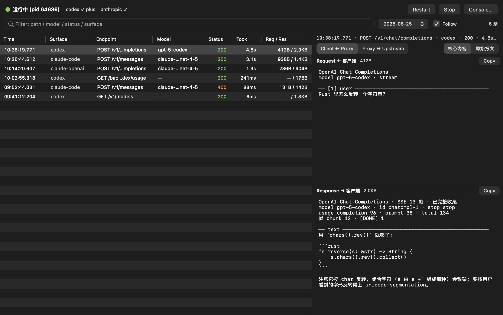

# jj-agentic-proxy

把已有的 Claude Pro / ChatGPT Plus 订阅额度，接到任何支持自定义 base url 的客户端上使用，不产生 API 账单。

形态是一个 macOS app：登录、启停、查看请求往返都在同一个窗口内完成；随附的同名终端命令提供完全一致的能力。



## 一、安装

系统要求 macOS 13 及以上。在 [Releases](https://github.com/yigegongjiang/jj-agentic-proxy/releases/latest) 页下载与本机架构对应的 `.dmg`：

<!-- prettier-ignore -->
| 机型 | 安装包 |
| --- | --- |
| Apple 芯片（M1 及之后） | `jj-agentic-proxy-macos-arm64.dmg` |
| Intel | `jj-agentic-proxy-macos-x86_64.dmg` |

打开 dmg，将图标拖入「应用程序」，双击运行。

首次运行会被 macOS 拦截，提示「未打开」「Apple 无法验证……是否包含恶意软件」。本 app 未购买 Apple 开发者签名，需手动放行一次：**系统设置 → 隐私与安全性 → 页面底部 → 「仍要打开」**，随后再次双击即可正常启动。该操作只需执行一次。

启动后 app 会弹出终端命令的安装提示，点「好」即写入 `~/.local/bin`。

升级：下载新版 `.dmg`，同样拖入「应用程序」覆盖，再打开 app 点击 **Restart**。

## 二、登录与启动

1. 点击 **Console…**，按订阅类型选择 **Login Codex**（ChatGPT Plus）或 **Login Anthropic**（Claude Pro），在浏览器中完成授权。两种订阅都持有时可分别登录。
2. 返回主窗口点击 **Start**。状态指示灯转绿并显示出账号与套餐即为运行中，此时该按钮变为 **Restart**；停止服务点 **Stop**。

服务以后台进程常驻，关闭窗口不会停止。

## 三、客户端配置

<!-- prettier-ignore -->
| surface | base port |
| --- | --- |
| openai | `http://127.0.0.1:10010` |
| openai-codex | `http://127.0.0.1:10010/backend-api/codex` |
| anthropic | `http://127.0.0.1:10011` |
| anthropic-openai | `http://127.0.0.1:10012` |

- **api key**：不填 / 填任意内容。
- **model**：可用取值见 **Console… → Models**
- base url 结尾的 `/v1` 加与不加均可
- 认 OpenAI 接口、想走 Codex 订阅通道，走 `openai`
- 认 Codex 订阅，走 `openai-codex`
- 认 OpenAI 接口、想走 Claude-Code 订阅通道，走 `anthropic-openai`
- 认 Anthropic 接口、想走 Claude-Code 订阅通道，走 `anthropic`
- 对于 `openai-codex` 通道，外部平台会自行拼接 url path，可按需填入 `xxx:10010、xxx:10010/backend-api、xxx:10010/backend-api/codex` 进行验证哪一个可用。
- 从手机或另一台电脑接入：把 `127.0.0.1` 换成 **Console… → Status** 中「局域网同端口」给出的 IP，端口不变

## 四、查看请求往返

主窗口逐条列出经过的请求：时间、入口、端点、model、状态码、耗时、请求与响应字节数。

- 顶部输入框按 path、model、状态码、入口过滤；右侧日期选择器切换到往日记录
- 勾选 **Follow** 自动跟随最新一条
- 选中某行后，右侧分 **Request** / **Response** 两栏展示，各带两组切换：
  - **Client ↔ Proxy** / **Proxy ↔ Upstream**：客户端发来的原始内容，或本机实际发往上游的内容
  - **核心内容** / **原始报文**：只看对话正文，或看完整报文
- 流式响应已重新组装为完整对话，不再是分片

其他设备用浏览器打开 `http://<局域网 IP>:10020`，可看到同样的内容。

记录按天存放于 `~/.config/jj-agentic-proxy/log/`，不会自动清理。

## 五、终端命令

app 上的按钮与下列子命令一一对应：

```bash
jj-agentic-proxy                # 启动（已在运行则重启）
jj-agentic-proxy stop           # 停止
jj-agentic-proxy status         # 运行状态、账号、套餐、局域网地址、固定 api key
jj-agentic-proxy models         # 当前可用的 model
jj-agentic-proxy logs -n 20     # 最近 20 条往返摘要
jj-agentic-proxy login codex    # 或 login anthropic
jj-agentic-proxy logout all     # 或 logout codex / logout anthropic
```

提示找不到命令时，将 `~/.local/bin` 加入 `PATH`。

## 注意事项

- **这几个端口不做鉴权**。同一网络内的任何人连上后即可消耗你的订阅额度并翻阅全部记录。仅建议在家庭或公司内网使用，**不要在路由器上把端口映射到公网**
- 首次启动时 macOS 可能询问「是否允许接受传入网络连接」，需选择允许。选择拒绝的表现是：本机访问正常，局域网内其他设备无法连接
- 少数客户端（如 pi-ai）会把 api key 当作 JWT 解析，这类客户端需改填 **Console… → Status** 中给出的那份固定 key

端点字段、记录格式与整体架构见 [ARCHITECTURE.md](./ARCHITECTURE.md)。
